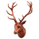
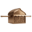

 

  
  

# Vedic Astrology Learn

Note: Anyone who wants to learn the basic elements of Vedic astrology can learn from this platform.

BCA 4th Semester Project — a Nepal-focused, bilingual (Nepali, Sanskrit preserved)
learning and reference platform for Vedic Astrology. It includes many Hindu mantras.

Built as a **W3Schools-style** study site — top navigation, a fixed **विषय सूची** sidebar,
topic pages with explanations and remedies, free courses with quizzes, a searchable index
and an admin panel.

> This is my BCA 4th semester project

## 1. What's in it

**Reference / study content**

- **27 नक्षत्र (Nakshatras)** — each with a Nepali explanation, English summary,
  personality characteristics, life-area effects and 2 remedies.

  
  
  
  
  
  
  
  
  
  
  
  
  
  
  
  
  
  
  
  
  
  
  
  
  
  
  

- **12 भाव (Houses)**, **12 राशि (Rashi)**, **9 ग्रह (Grahas)** — descriptions,
  characteristics, effects and remedies for each.

- **108 graha × bhava** (9 grahas × 12 houses) and **12 graha × rashi** combination
  interpretations in the **संयोजन विश्लेषण** tool.
- **396 mantras** of every rashi, graha, nakshatra etc.

## 2. Content note

- Topic explanations were written for this project from classical references
  (`Brihat Parashara Hora Shastra`, `Vedanga Jyotisha`, etc.).
- All content is for **study purposes only** and is not a substitute for professional
  astrological advice.
<a href="https://sudipgautam.info.np">Visit Website</a>
