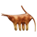

 

  
  
  

# Vedic Astrology Learn

Note : Who want to learn basic vedic astrology elements they can learn from this platform

BCA 4th Semester Project — a Nepal-focused, bilingual (Nepali, Sanskrit preserved)
learning and reference platform for Vedic Astrology , it include many hindusim mantras.

Built as a **W3Schools.com** study site:

> This is my Bca 4th semester project  

## 1. What's in it

**Reference / study content**

- **27 नक्षत्र (Nakshatras)** — each with a Nepali explanation, English summary,
  personality characteristics, life-area effects and 2 remedies.

  
  
  
   
   
   
   
   
    
    
    
    
    
    
    
    
    
    
    
    
    
    
    
    
    
    
    
    
    
    
    
    

- **12 भाव (Houses)**, **12 राशि (Rashi)**, **9 ग्रह (Grahas)** — descriptions,
  characteristics, effects and remedies for each.

- **27 graha × bhava** and **12 graha × rashi** combination interpretations.
- **mantras** many mantras of every rashi , graha etc.
## 2. Content note

- Topic explanations were written for this project from classical references
  (`Brihat Parashara Hora Shastra`, `Vedanga Jyotisha`, etc.).
- All content is for **study purposes only** and is not a substitute for professional
  astrological advice.
<a href="https://sudipgautam.info.np">Visit Website</a>

git add .
git commit -m "Update project"
git push
