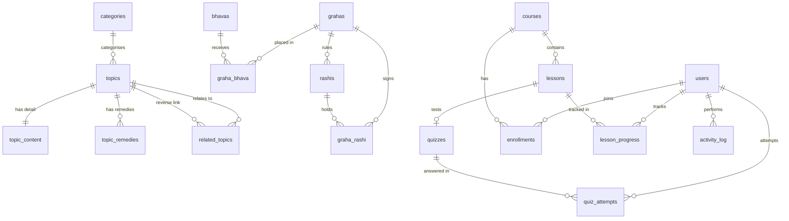

# ER Diagram & Schema Notes — Vedic Astrology Learn

Companion document to `sql/schema.sql`. Use this for your report's
"Database Design" chapter and to draw the ER diagram in draw.io / Lucidchart.

---

## 1. Entity Groups

The schema is split into six logical groups so the diagram stays readable.
In draw.io, place each group inside a rectangle labelled by section.

| Group | Tables |
|---|---|
| A. Users | `users` |
| B. Content | `categories`, `topics`, `topic_content`, `topic_remedies`, `related_topics` |
| C. Canonical entities | `grahas`, `bhavas`, `rashis` |
| D. Combinations | `graha_bhava`, `graha_rashi` |
| E. LMS | `courses`, `lessons`, `quizzes`, `enrollments`, `lesson_progress`, `quiz_attempts` |
| F. Search & audit | `search_index`, `activity_log` |

---

## 2. Relationship Map (Mermaid)

Paste this into any Mermaid renderer to get the diagram instantly.



---

## 3. Cardinality Table (for your report)

Write this straight into the "Relationships" section.

| # | Relationship | Type | FK → PK | Rule |
|---|---|---|---|---|
| 1 | `categories` 1 → N `topics` | 1:N | `topics.category_id` | `ON DELETE RESTRICT` — a topic must always have a valid category |
| 2 | `topics` 1 → 1 `topic_content` | 1:1 | `topic_content.topic_id` (also its PK) | `ON DELETE CASCADE` |
| 3 | `topics` 1 → N `topic_remedies` | 1:N | `topic_remedies.topic_id` | `ON DELETE CASCADE` |
| 4 | `topics` N → N `topics` (self) | M:N | via `related_topics` composite PK | `ON DELETE CASCADE`, `CHECK` blocks self-link |
| 5 | `grahas` N → N `bhavas` | M:N | `graha_bhava` composite PK | `ON DELETE CASCADE` — **this is the combo engine** |
| 6 | `grahas` N → N `rashis` | M:N | `graha_rashi` composite PK | `ON DELETE CASCADE` — **this is the combo engine** |
| 7 | `grahas` 1 → N `rashis` | 1:N | `rashis.ruler_graha_id` | `ON DELETE SET NULL` — a sign can survive its ruler being removed |
| 8 | `courses` 1 → N `lessons` | 1:N | `lessons.course_id` | `ON DELETE CASCADE` |
| 9 | `lessons` 1 → 1 `quizzes` | 1:1 | `quizzes.lesson_id` (`UNIQUE`) | `ON DELETE CASCADE` |
| 10 | `users` N → N `courses` | M:N | `enrollments` `UNIQUE(user_id, course_id)` | Prevents double-enrolment |
| 11 | `users` N → N `lessons` | M:N | `lesson_progress` composite PK | Progress tracking |
| 12 | `users` 1 → N `quiz_attempts` | 1:N | `quiz_attempts.user_id` | Attempt history |
| 13 | `users` 1 → N `activity_log` | 1:N | `activity_log.user_id` | Admin audit |

---

## 4. Normalisation Proof (3NF)

This is the section examiners check. Argue each normal form explicitly.

### 1NF — Atomic
- Every column holds a single value. No lists, no composite fields.
- Multi-valued data was **extracted** into child tables:
  - one topic's many remedies → `topic_remedies`
  - topic-to-topic links → `related_topics`
  - quiz options → four separate columns `option_a`..`option_d`
  - `related_topics` is a genuine repeating group, not a comma-separated string.

### 2NF — No partial dependency
- `graha_bhava` and `graha_rashi` use a **composite key** `(graha_id, bhava_id)` / `(graha_id, rashi_id)`.
- All non-key columns (`interpretation_np`, `challenges`, `remedies`, …) depend on the **whole** pair, not on one part.
  - `challenges` describes *Saturn in the 7th*, not *Saturn generally* and not *the 7th generally*.
  - If it depended on one part, it would have to move to `grahas` or `bhavas`. It does not.
- `lesson_progress` key `(user_id, lesson_id)` — both columns are the PK, so no partial dependency is possible.
- Conclusion: **2NF holds.**

### 3NF — No transitive dependency
- Non-key attributes depend only on the key, not on other non-key attributes.
- The apparent counter-example was `bhavas` ↔ `graha_bhava`:
  - `bhavas` stores fixed attributes (`house_number`, `sanskrit_name`, `name_np`) — the lookup.
  - `graha_bhava` stores only *relationship* data.
  - No column in `bhavas` depends on a column in `graha_bhava`. Deleting all combos leaves a valid sign list.
- `rashis.element` is functionally determined by `rashis` alone, not by any other non-key column — the composite key is just `id`, so 3NF is trivially satisfied.
- Conclusion: **3NF holds. No BCND violation found.**

> If asked about BCND: the only candidate keys are single-column `id`s and the
> composite pairs. Every determinant in the schema is either a key or a foreign
> key that is itself a key in the referenced table, so all determinants are
> candidate keys. **BCNF holds.**

---

## 5. Design Decisions (justify these in the viva)

| Decision | Why |
|---|---|
| **`utf8mb4` + `utf8mb4_unicode_ci`** | `utf8` (3-byte) cannot store some Devanagari and Sanskrit conjuncts, and cannot store emoji. Nepal's script requires `utf8mb4`. |
| **`ENUM` for `role`, `correct_option`** | Compact and self-documenting; the DB rejects invalid values, so PHP cannot insert `'adminn'`. |
| **Composite PK on junction tables** | Makes duplicate combinations impossible at the storage layer, not just in application code. |
| **1:1 split of `topics` / `topic_content`** | Listing pages only need `topics`. Without the split, every sidebar query would drag `MEDIUMTEXT` through the join. This is a deliberate performance normalisation. |
| **`ON DELETE CASCADE` on content** | Deleting a topic must not orphan its remedies or combo rows. |
| **`ON DELETE RESTRICT` on `topics.category_id`** | Accidentally deleting a category must fail loudly, not silently remove 300 topics. |
| **`ON DELETE SET NULL` on `rashis.ruler_graha_id`** | A sign's ruler is descriptive metadata; losing it is preferable to blocking the delete. |
| **`search_index` as a derived table** | It is a read-optimised projection. Rebuilding it is cheap; never treat it as the source of truth. |
| **`activity_log`** | Demonstrates the separation of authentication from authorisation, and gives the admin panel an audit trail. |

---

## 6. Draw.io Setup (5 minutes)

1. Open [app.diagrams.net](https://app.diagrams.net).
2. **Entity** shape per table. Enable *Entity Relation* → *Show cardinality*.
3. Draw the six group rectangles from §1 behind the tables.
4. Start with the two junction tables `graha_bhava` and `graha_rashi` in the centre — they are the heart of the project.
5. Save as PNG at ≥150 DPI for the report appendix.

---

## 7. Before You Run schema.sql

1. **MySQL 5.7 note** — `CHECK` constraints are ignored before MySQL 8.0.16. On XAMPP with MariaDB 10.x the `chk_not_self` rule will be silently dropped. The table still works; add a PHP-side guard on `related_topics` if your examiner asks.
2. **Admin password** — the seeded hash is the literal string `REPLACE_WITH_PHP_BCRYPT_HASH`. Generate a real one:
   ```bash
   php -r "echo password_hash('admin123', PASSWORD_DEFAULT), PHP_EOL;"
   ```
3. **Import** via phpMyAdmin → Import, or:
   ```bash
   mysql -u root -p < sql/schema.sql
   ```
4. **Verify** with the queries at the bottom of `schema.sql`. Expected: 9 grahas, 12 bhavas, 12 rashis, 9 categories.

---

## 8. What Is Still Missing (Phase 2)

These are deliberately not in the schema. Do not add them unless you have the
content to fill them, or the empty tables will look unfinished:

- `bhava_rashi` (12 × 12 = 144) — the third combination axis, deferred to v2
- `nakshatras`, `tithis`, `yogas`, `karanas` as canonical entities — these are
  currently only `topics` rows under their categories, which is enough for
  learning content but not for a combo engine
- `consultations` + `consult_slots` — the 1:1 booking revenue line from the
  business model; needs a calendar UI, so it belongs in its own phase
